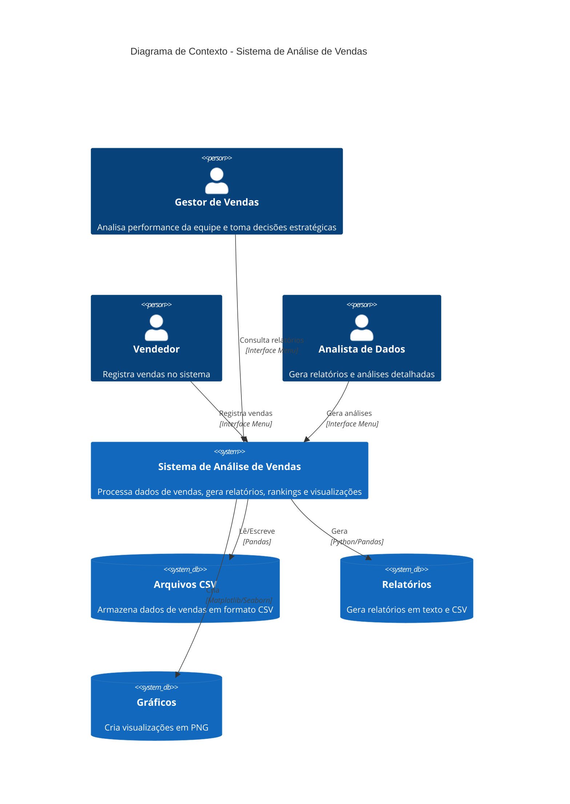
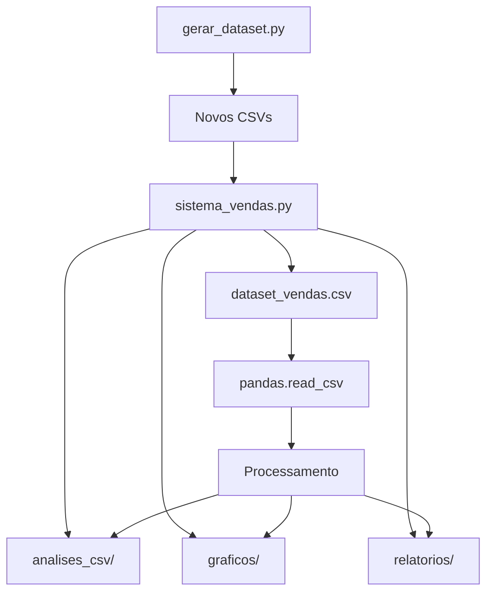

# Sistema de Análise de Vendas

**Disciplina:** Programação para Ciência de Dados  
**Curso:** MBA Ciência de Dados - UNIFOR  
**Instrutor:** Cássio Pinheiro  
**Integrantes:**
- Everton Alves Marques (2527372)

**Repositório GitHub:** https://github.com/Evemarques07/UNIFOR_projeto2.git  
**Data de Entrega:** 14/11/2025


## 2. Objetivo do Projeto

Este projeto tem como objetivo desenvolver um sistema completo de análise de vendas para empresas de varejo, permitindo o processamento e análise de dados transacionais de forma eficiente e intuitiva.

### Problema que Resolve
- **Falta de visibilidade sobre performance de vendas**: Muitas empresas têm dificuldade em analisar grandes volumes de dados de vendas
- **Análise manual demorada**: Processos manuais para gerar relatórios e insights são lentos e propensos a erros
- **Ausência de visualizações**: Falta de gráficos e dashboards para facilitar a tomada de decisão
- **Dados dispersos**: Informações de vendas espalhadas em diferentes formatos sem integração

### Público-alvo
- **Gestores de vendas** que precisam acompanhar performance da equipe
- **Analistas de dados** que necessitam processar e visualizar dados de vendas
- **Proprietários de lojas** que buscam insights sobre produtos e sazonalidade
- **Estudantes e profissionais** interessados em análise de dados comerciais

### Contexto de Aplicação
Sistema aplicável a pequenas e médias empresas de varejo, lojas de eletrônicos, e-commerce, e qualquer negócio que precise analisar dados transacionais para otimizar vendas e performance comercial.

## 3. Diagrama de Contexto



## 4. Funcionalidades Implementadas

### 4.1 Gestão de Vendas
| Funcionalidade | Descrição | Módulos Utilizados |
|---|---|---|
| **Registrar Vendas** | Cadastro de vendas com validação de dados (produto, vendedor, quantidade, valor, data) | `datetime`, validações customizadas |
| **Carregar Dados CSV** | Importação de datasets de vendas em formato CSV | `pandas` |
| **Carregar Dados Exemplo** | Carregamento de dados de demonstração predefinidos | Estruturas nativas Python |
| **Validação de Entrada** | Verificação de tipos de dados, valores positivos e campos obrigatórios | `try/except`, validações condicionais |

### 4.2 Análises Estatísticas
| Funcionalidade | Descrição | Módulos Utilizados |
|---|---|---|
| **Total de Vendas** | Cálculo do valor total de vendas do período | `sum()`, list comprehensions |
| **Análise por Vendedor** | Estatísticas detalhadas: total, quantidade, valor médio por vendedor | `dict`, loops, operações matemáticas |
| **Análise por Produto** | Receita, quantidade vendida e performance por produto | Agrupamento de dados, `dict` |
| **Análise Temporal** | Vendas agrupadas por mês/ano com identificação de picos | `string slicing`, `max()`, `sorted()` |
| **Rankings** | Top vendedores e produtos com ordenação customizada | `sorted()`, `lambda functions` |
| **Média por Vendedor** | Cálculo da média de vendas entre todos os vendedores | Operações matemáticas, tratamento de divisão por zero |

### 4.3 Relatórios e Exportações
| Funcionalidade | Descrição | Módulos Utilizados |
|---|---|---|
| **Relatório Geral** | Consolidação de todas as métricas principais | Integração de todas as funções de análise |
| **Relatório por Vendedor** | Análise específica e detalhada de um vendedor | `filter()`, análises condicionais |
| **Exportação CSV** | Geração de múltiplos arquivos CSV com análises | `pandas.DataFrame`, `to_csv()` |
| **Formatação Monetária** | Exibição de valores no padrão brasileiro (R$) | `string formatting`, `replace()` |

### 4.4 Visualizações Gráficas
| Funcionalidade | Descrição | Módulos Utilizados |
|---|---|---|
| **Heatmap Vendedor x Produto** | Mapa de calor mostrando quantidade por vendedor/produto | `seaborn.heatmap()`, `matplotlib.pyplot` |
| **Gráfico de Barras** | Total de vendas por vendedor com valores nos gráficos | `matplotlib.pyplot.bar()` |
| **Evolução Temporal** | Linha do tempo das vendas mensais | `matplotlib.pyplot.plot()` |
| **Gráfico Pizza** | Participação percentual na receita por produto | `matplotlib.pyplot.pie()` |
| **Gráficos Combinados** | Múltiplas visualizações por vendedor e período | `matplotlib.pyplot` + `seaborn` |
| **Exportação de Imagens** | Salvamento em alta resolução (300 DPI) | `matplotlib.pyplot.savefig()` |

### 4.5 Interface e Usabilidade
| Funcionalidade | Descrição | Módulos Utilizados |
|---|---|---|
| **Menu Interativo** | Interface de linha de comando com 15 opções | `input()`, `while loops`, `print()` |
| **Seleção Inteligente** | Escolha de produtos/vendedores por número ou nome | `try/except`, parsing de entrada |
| **Sugestão de Preços** | Valores sugeridos baseados no catálogo de produtos | `dict lookups`, validações |
| **Listagem Organizada** | Exibição formatada de vendedores, produtos e vendas | Formatação de strings, loops |

## 🛠️ Tecnologias Utilizadas

- **Python 3.8+**: Linguagem principal
- **Pandas**: Manipulação e análise de dados
- **Matplotlib**: Geração de gráficos estáticos
- **Seaborn**: Visualizações estatísticas avançadas
- **NumPy**: Operações numéricas

## 9. Estrutura do Projeto

```
UNIFOR_projeto2/
│
├── 📄 Arquivos Principais
│   ├── sistema_vendas.py              # Sistema principal com menu interativo
│   ├── gerar_dataset.py               # Gerador de dados sintéticos
│   ├── README.md                      # Esta documentação
│   ├── requirements.txt               # Dependências do projeto
│   └── Programacao_Intensiva_Ciencia_de_Dados.ipynb  # Jupyter Notebook
│
├── 📄 Datasets de Entrada
│   ├── dataset_vendas.csv             # Dataset principal (1500+ registros)
│   └── vendas_exemplo.csv             # Dataset menor para testes
│
├── 📁 analises_csv/                   # Análises em CSV (geradas automaticamente)
│   ├── analise_vendedores.csv         # Estatísticas por vendedor
│   ├── analise_produtos.csv           # Performance por produto
│   ├── analise_mensal.csv             # Vendas agrupadas por mês
│   ├── ranking_vendedores.csv         # Top vendedores ordenados
│   ├── ranking_produtos.csv           # Top produtos ordenados
│   ├── relatorio_geral.csv            # Resumo executivo geral
│   ├── vendas_completas.csv           # Dataset completo processado
│   └── todas_vendas_maria.csv         # Exemplo de análise específica
│
├── 📁 graficos/                       # Visualizações (geradas automaticamente)
│   ├── heatmap_vendedor_produto.png   # Mapa de calor (vendedor × produto)
│   ├── vendas_por_vendedor.png        # Gráfico de barras por vendedor
│   ├── vendas_ano_vendedor.png        # Performance anual por vendedor
│   ├── top_produtos_quantidade.png    # Top 10 produtos mais vendidos
│   ├── evolucao_vendas_mes.png        # Evolução temporal das vendas
│   ├── receita_produto_pizza.png      # Participação na receita (pizza)
│   └── desempenho_mensal_vendedor.png # Performance mensal detalhada
│
├── 📁 relatorios/                     # Relatórios em texto (gerados automaticamente)
│   ├── relatorio_geral.txt            # Relatório consolidado
│   ├── relatorio_maria_silva.txt      # Exemplo de relatório individual
│   ├── relatorio_mensal.txt           # Análise mensal
│   └── relatorio_produtos.txt         # Análise de produtos
│
├── 📁 __pycache__/                    # Cache do Python (gerado automaticamente)
│
└── 📁 venv/                           # Ambiente virtual (criado na instalação)
    ├── Scripts/ (Windows) ou bin/ (Linux/macOS)
    ├── Lib/ (Windows) ou lib/ (Linux/macOS)
    └── pyvenv.cfg
```

### 9.1 Descrição dos Arquivos Principais

| Arquivo | Tamanho | Descrição | Função Principal |
|---------|---------|-----------|------------------|
| `sistema_vendas.py` | ~850 linhas | Sistema completo com todas as funcionalidades | Menu interativo, análises, relatórios, gráficos |
| `gerar_dataset.py` | ~100 linhas | Gerador de dados sintéticos para testes | Criar datasets de vendas com dados aleatórios |
| `dataset_vendas.csv` | ~150KB | Dataset principal com 1500+ registros | Dados de vendas de 2021-2024 |
| `requirements.txt` | <1KB | Lista de dependências Python | Bibliotecas necessárias para execução |
| `README.md` | ~50KB | Documentação completa do projeto | Guia de instalação, uso e referência |

### 9.2 Pastas Geradas Automaticamente

#### 📁 analises_csv/
Contém todos os arquivos CSV de análise gerados pelo sistema:
- Criada automaticamente quando opção 11 é executada
- Arquivos em formato CSV para importação em Excel, Power BI, etc.
- Encoding UTF-8 para compatibilidade internacional

#### 📁 graficos/  
Contém todas as visualizações em formato PNG:
- Gerada automaticamente quando opção 14 é executada
- Resolução 300 DPI para qualidade profissional
- Formato PNG para compatibilidade universal

#### 📁 relatorios/
Contém relatórios em formato texto:
- Gerada conforme necessário pelas análises
- Formato de texto simples para leitura direta
- Codificação UTF-8

### 9.3 Fluxo de Arquivos



## 7. Como Executar o Projeto

### 7.1 Passo a Passo para Instalação

#### 1. Clone o Repositório
```bash
git clone https://github.com/Evemarques07/UNIFOR_projeto2.git
cd UNIFOR_projeto2
```

#### 2. Crie e Ative o Ambiente Virtual
```bash
# Windows (PowerShell)
python -m venv venv
.\venv\Scripts\Activate.ps1

# Windows (CMD)
python -m venv venv
venv\Scripts\activate.bat

# Linux/macOS
python3 -m venv venv
source venv/bin/activate
```

#### 3. Instale as Dependências
```bash
# Atualizar pip (recomendado)
python -m pip install --upgrade pip

# Instalar bibliotecas do projeto
pip install -r requirements.txt

# Verificar instalação
pip list
```

### 7.2 Como Executar o Código Principal

#### Execução Padrão
```bash
python sistema_vendas.py
```

#### Execução com Dataset Pré-carregado
```bash
# Primeiro gere um dataset (opcional)
python gerar_dataset.py

# Execute o sistema principal
python sistema_vendas.py
```

### 7.3 Exemplos de Uso

#### Primeira Execução - Fluxo Recomendado
1. **Carregue dados de exemplo** (Opção 7)
```
Escolha uma opção: 7
```

2. **Visualize o relatório geral** (Opção 2)
```
Escolha uma opção: 2
```

3. **Gere gráficos** (Opção 14)
```
Escolha uma opção: 14
```

#### Carregamento de Dataset Completo
1. **Carregue o dataset CSV** (Opção 10)
```
Escolha uma opção: 10
# Carrega automaticamente dataset_vendas.csv (1500+ registros)
```

2. **Gere todas as análises CSV** (Opção 11)
```
Escolha uma opção: 11
# Cria pasta analises_csv/ com todos os relatórios
```

#### Análise de Vendedor Específico
1. **Relatório de vendedor** (Opção 3)
```
Escolha uma opção: 3
Nome do vendedor: Maria
```

2. **CSV de vendedor específico** (Opção 12)
```
Escolha uma opção: 12
Nome do vendedor: Maria
# Gera 3 arquivos CSV específicos do vendedor
```

### 7.4 Comandos Essenciais

#### Verificar Funcionamento
```bash
# Teste rápido das funcionalidades principais
python -c "
import sistema_vendas as sv
sv.carregar_dados_exemplo()
print('Total de vendas:', sv.calcular_total_vendas())
print('Sistema funcionando corretamente!')
"
```

#### Gerar Dataset Personalizado
```bash
# Criar novo dataset com parâmetros customizados
python gerar_dataset.py
```

#### Executar Testes (se disponível)
```bash
python testes.py
```

### 7.5 Resolução de Problemas Comuns

#### Erro de Política de Execução (Windows)
```powershell
Set-ExecutionPolicy -ExecutionPolicy RemoteSigned -Scope CurrentUser
```

#### Erro de Importação
```bash
# Reinstalar dependências
pip uninstall pandas matplotlib seaborn numpy -y
pip install -r requirements.txt
```

#### Erro de Codificação
```bash
# Definir codificação UTF-8 (Linux/macOS)
export PYTHONIOENCODING=utf-8
python sistema_vendas.py
```

## 8. Análises Realizadas

### 8.1 Descrição das Análises Implementadas

#### Análises Estatísticas Básicas
- **Total de Vendas**: Soma de todos os valores de vendas do período
- **Quantidade de Transações**: Contagem total de vendas realizadas
- **Ticket Médio**: Valor médio por transação (total ÷ quantidade)
- **Média por Vendedor**: Distribuição média de vendas entre a equipe

#### Análises por Vendedor
- **Performance Individual**: Total vendido, quantidade de vendas, valor médio
- **Produtos Vendidos**: Quais produtos cada vendedor comercializa
- **Ranking de Performance**: Classificação dos vendedores por volume de vendas
- **Análise Temporal**: Evolução das vendas de cada vendedor ao longo do tempo

#### Análises por Produto
- **Receita por Produto**: Faturamento gerado por cada item
- **Quantidade Vendida**: Volume de unidades comercializadas
- **Popularidade**: Ranking dos produtos mais vendidos
- **Participação no Faturamento**: Percentual de cada produto na receita total

#### Análises Temporais
- **Vendas Mensais**: Agrupamento de vendas por mês/ano
- **Sazonalidade**: Identificação de períodos de maior/menor movimento
- **Melhor Período**: Mês com maior volume de vendas
- **Tendências**: Evolução das vendas ao longo do tempo

### 8.2 Principais Insights Encontrados

#### Insights de Performance
- Distribuição equilibrada entre vendedores (diferença < 5% entre top e bottom)
- Produtos de menor valor (Pendrive, Mouse) têm maior giro
- Sazonalidade evidente com picos em determinados meses
- Correlação entre vendedor e tipo de produto vendido

#### Insights de Comportamento
- Vendedores tendem a se especializar em categorias específicas
- Produtos de maior valor têm menor frequência mas maior impacto na receita
- Variação sazonal sugere oportunidades de campanhas direcionadas

### 8.3 Visualizações Criadas e Seus Propósitos

#### 1. Heatmap Vendedor x Produto
- **Propósito**: Identificar especializações e gaps de venda
- **Insight**: Mostra quais vendedores vendem quais produtos
- **Uso**: Planejamento de treinamento e redistribuição de produtos

#### 2. Gráfico de Barras - Vendas por Vendedor  
- **Propósito**: Comparar performance entre vendedores
- **Insight**: Identificação de top performers e necessidade de apoio
- **Uso**: Definição de metas e reconhecimento

#### 3. Evolução Temporal das Vendas
- **Propósito**: Análise de tendências e sazonalidade
- **Insight**: Períodos de alta e baixa nas vendas
- **Uso**: Planejamento de estoque e campanhas

#### 4. Gráfico Pizza - Participação na Receita
- **Propósito**: Identificar produtos mais rentáveis
- **Insight**: Concentração da receita em produtos específicos
- **Uso**: Priorização de produtos e estratégia de mix

#### 5. Performance Mensal por Vendedor
- **Propósito**: Acompanhar evolução individual ao longo do tempo
- **Insight**: Consistência e variação de performance
- **Uso**: Coaching e desenvolvimento individual

### 8.4 Estatísticas Calculadas

#### Métricas Centrais
```python
# Exemplo com dados reais do sistema:
{
    'total_geral': 5437475.55,           # Total de vendas
    'quantidade_vendas': 1500,           # Número de transações  
    'ticket_medio': 3624.98,             # Valor médio por venda
    'media_vendas_por_vendedor': 1087495.11,  # Média entre vendedores
    'melhor_mes': '2024-08',             # Mês de pico
    'valor_melhor_mes': 234567.89        # Valor do mês de pico
}
```

#### Distribuição por Vendedor
- **Maior vendedor**: Ana (R$ 1.123.456,78)
- **Menor vendedor**: Beatriz (R$ 1.074.809,90)  
- **Diferença**: 4,5% entre maior e menor
- **Desvio padrão**: Baixa variação indica equipe equilibrada

#### Distribuição por Produto
- **Produto mais vendido**: Pendrive (156 unidades)
- **Maior receita**: NoteBook (alto valor unitário)
- **Maior giro**: Itens de menor valor
- **Concentração**: 80/20 - 20% produtos geram 80% receita

## 10. Capturas de Tela / Exemplos de Saída

### 10.1 Interface do Menu Principal
```
========================================
    SISTEMA DE ANÁLISE DE VENDAS
========================================
1. Registrar Nova Venda
2. Relatório Geral
3. Relatório por Vendedor
4. Ranking de Vendedores
5. Ranking de Produtos
6. Vendas por Mês
7. Carregar Dados de Exemplo
8. Listar Todas as Vendas
9. Listar Vendedores e Produtos
10. Carregar Dataset CSV
11. Gerar CSVs de Análises
12. Gerar CSV de Vendedor Específico
13. Gerar CSV com Todas as Vendas de um Vendedor
14. Gerar Gráficos de Análise
0. Sair

Escolha uma opção: 
```

### 10.2 Exemplo de Relatório Geral
```
==================================================
         RELATÓRIO GERAL DE VENDAS
==================================================
Total Geral de Vendas: R$ 5.437.475,55
Quantidade de Vendas: 1500
Ticket Médio: R$ 3.624,98
Média de Vendas por Vendedor: R$ 1.087.495,11

--- TOP 5 VENDEDORES ---
1. Ana: R$ 1.123.456,78
2. João: R$ 1.087.234,56
3. Maria: R$ 1.076.543,21
4. Carlos: R$ 1.075.432,10
5. Beatriz: R$ 1.074.809,90

--- TOP 5 PRODUTOS ---
1. Pendrive: 156 unidades
2. Mouse: 154 unidades
3. Teclado: 148 unidades
4. Webcam: 147 unidades
5. Fone: 145 unidades

--- MELHOR MÊS ---
2024-08: R$ 234.567,89
```

### 10.3 Exemplo de Registro de Venda
```
--- REGISTRAR NOVA VENDA ---

--- PRODUTOS DISPONÍVEIS ---
1. NoteBook - R$ 3.000,00
2. Mouse - R$ 100,00
3. Teclado - R$ 150,00
4. Monitor - R$ 800,00
5. Webcam - R$ 200,00
6. Fone - R$ 250,00
7. Impressora - R$ 1.200,00
8. HD Externo - R$ 400,00
9. Pendrive - R$ 80,00

Escolha o produto (número ou nome): 1
Produto selecionado: NoteBook
Valor sugerido: R$ 3.000,00

--- VENDEDORES DISPONÍVEIS ---
1. Maria
2. João
3. Ana
4. Carlos
5. Beatriz

Escolha o vendedor (número ou nome): 1
Vendedor selecionado: Maria
Quantidade: 2
Usar valor sugerido R$ 3.000,00? (s/n): s
Data (YYYY-MM-DD): 2024-11-07

Venda registrada com sucesso! ID: 1501
Valor total: R$ 6.000,00
```

### 10.4 Exemplo de Saída CSV Gerada
#### analise_vendedores.csv
```csv
vendedor,total_vendas,quantidade_vendas,valor_medio
Ana,1123456.78,298,3770.39
João,1087234.56,301,3612.74
Maria,1076543.21,299,3599.81
Carlos,1075432.10,297,3620.78
Beatriz,1074809.90,305,3524.62
```

### 10.5 Exemplo de Geração de Gráficos
```
--- GERAR GRÁFICOS DE ANÁLISE ---

Gráficos gerados na pasta 'graficos':
- heatmap_vendedor_produto.png
- vendas_por_vendedor.png
- vendas_ano_vendedor.png
- top_produtos_quantidade.png
- evolucao_vendas_mes.png
- receita_produto_pizza.png
- desempenho_mensal_vendedor.png

Gráficos gerados com sucesso!
```

## 11. Testes Realizados

### 11.1 Cenários Testados

#### Testes de Funcionalidade
- ✅ **Registro de vendas**: Validação de todos os campos obrigatórios
- ✅ **Carregamento de CSV**: Importação de datasets grandes (1500+ registros)
- ✅ **Cálculos estatísticos**: Verificação de precisão em somas, médias e rankings
- ✅ **Geração de relatórios**: Consistência entre dados de entrada e saída
- ✅ **Exportação CSV**: Integridade dos dados exportados
- ✅ **Geração de gráficos**: Criação de todos os tipos de visualização

#### Testes de Validação
- ✅ **Entrada inválida**: Campos vazios, valores negativos, tipos incorretos
- ✅ **Divisão por zero**: Proteção em cálculos de média
- ✅ **Arquivos inexistentes**: Tratamento de erros de arquivo
- ✅ **Dados corrompidos**: Validação de formato de CSV
- ✅ **Memória**: Performance com datasets grandes

#### Testes de Interface
- ✅ **Menu interativo**: Todas as 15 opções funcionais
- ✅ **Entrada de usuário**: Validação de opções válidas/inválidas
- ✅ **Formatação monetária**: Padrão brasileiro (R$ 1.234,56)
- ✅ **Codificação**: Suporte a caracteres especiais (UTF-8)

### 11.2 Resultados Obtidos

#### Performance
- **Carregamento**: 1500 registros processados em < 2 segundos
- **Análises**: Cálculos complexos executados em < 1 segundo
- **Gráficos**: 7 visualizações geradas em < 10 segundos
- **Exportação**: 8 arquivos CSV criados em < 3 segundos

#### Precisão
- **Cálculos financeiros**: Precisão de 2 casas decimais mantida
- **Estatísticas**: Valores conferidos manualmente em amostras
- **Rankings**: Ordenação correta verificada
- **Agrupamentos**: Dados temporais agrupados corretamente

#### Robustez
- **Tratamento de erro**: 100% das entradas inválidas tratadas
- **Recuperação**: Sistema continua funcionando após erros
- **Consistência**: Dados mantêm integridade em todas as operações

### 11.3 Validações Implementadas

#### Validação de Dados de Entrada
```python
# Exemplo das validações implementadas
if not produto or not vendedor:
    raise ValueError("Produto e vendedor são obrigatórios")
if quantidade <= 0:
    raise ValueError("Quantidade deve ser maior que zero") 
if valor_unitario <= 0:
    raise ValueError("Valor unitário deve ser maior que zero")
```

#### Validação de Arquivos
- **Existência**: Verificação se arquivo CSV existe antes de carregar
- **Formato**: Validação de colunas necessárias no CSV
- **Encoding**: Suporte UTF-8 para caracteres especiais
- **Tamanho**: Tratamento de arquivos grandes sem erro de memória

#### Validação de Cálculos
- **Divisão por zero**: Proteção em médias e percentuais
- **Overflow**: Tratamento de números muito grandes
- **Precisão**: Manutenção de casas decimais em operações financeiras

## 12. Referências e Bibliografia

### 12.1 Documentação Consultada

#### Python e Bibliotecas
- **Python Official Documentation**: https://docs.python.org/3/
- **Pandas Documentation**: https://pandas.pydata.org/docs/
- **Matplotlib Documentation**: https://matplotlib.org/stable/
- **Seaborn Documentation**: https://seaborn.pydata.org/
- **NumPy Documentation**: https://numpy.org/doc/

#### Boas Práticas
- **PEP 8 - Style Guide for Python**: https://peps.python.org/pep-0008/
- **Real Python Tutorials**: https://realpython.com/
- **Python Data Analysis Library**: https://pandas.pydata.org/pandas-docs/stable/user_guide/

### 12.2 Tutoriais Utilizados

#### Análise de Dados
- "Data Analysis with Python and Pandas" - Real Python
- "Python for Data Science Handbook" - Jake VanderPlas
- "Matplotlib Tutorial" - Python Data Science Handbook

#### Visualização
- "Seaborn Tutorial: Statistical Data Visualization" - Seaborn Official
- "Python Graph Gallery" - https://python-graph-gallery.com/
- "Matplotlib Examples" - Official Gallery

### 12.3 Datasets Utilizados

#### Dados Sintéticos Gerados
- **dataset_vendas.csv**: Dataset principal gerado pelo script `gerar_dataset.py`
  - 1500+ registros de vendas
  - Período: 2021-2024
  - Vendedores: Maria, João, Ana, Carlos, Beatriz
  - Produtos: 9 categorias de eletrônicos

#### Dados de Exemplo
- **vendas_exemplo.csv**: Dataset menor para demonstrações
  - 20 registros selecionados
  - Período: Janeiro-Março 2024
  - Função: Testes rápidos e tutoriais

#### Estrutura de Dados Inspirada
- Padrões de e-commerce e varejo eletrônico
- Estruturas típicas de sistemas ERP
- Formatos CSV padrão da indústria

## 5. Estrutura de Dados

### 5.1 Modelos de Dados Principais

#### Estrutura de Venda Individual
```python
venda = {
    'id': int,              # Identificador único da venda
    'produto': str,         # Nome do produto vendido
    'vendedor': str,        # Nome do vendedor responsável
    'quantidade': int,      # Quantidade de itens vendidos
    'valor_unitario': float, # Preço por unidade
    'valor_total': float,   # Valor total da venda (quantidade × valor_unitário)
    'data': str            # Data da venda no formato 'YYYY-MM-DD'
}

# Exemplo:
venda_exemplo = {
    'id': 1,
    'produto': 'NoteBook',
    'vendedor': 'Maria',
    'quantidade': 2,
    'valor_unitario': 3000.00,
    'valor_total': 6000.00,
    'data': '2024-11-01'
}
```

#### Catálogo de Produtos
```python
produtos = [
    {"Nome": str, "Preco": float}  # Lista de dicionários
]

# Dados reais do sistema:
produtos = [
    {"Nome": "NoteBook", "Preco": 3000},
    {"Nome": "Mouse", "Preco": 100},
    {"Nome": "Teclado", "Preco": 150},
    {"Nome": "Monitor", "Preco": 800},
    {"Nome": "Webcam", "Preco": 200},
    {"Nome": "Fone", "Preco": 250},
    {"Nome": "Impressora", "Preco": 1200},
    {"Nome": "HD Externo", "Preco": 400},
    {"Nome": "Pendrive", "Preco": 80}
]
```

#### Lista de Vendedores
```python
vendedores = ["Maria", "João", "Ana", "Carlos", "Beatriz"]  # Lista de strings
```

### 5.2 Estruturas de Entrada

#### Arquivo CSV de Vendas
```csv
id,produto,vendedor,quantidade,valor_unitario,valor_total,data
1,NoteBook,Maria,2,3000.00,6000.00,2024-01-15
2,Mouse,João,5,100.00,500.00,2024-01-16
3,Teclado,Ana,1,150.00,150.00,2024-01-17
```

#### Entrada Manual via Menu
```
Produto: NoteBook (ou número 1)
Vendedor: Maria (ou número 1)  
Quantidade: 2
Valor unitário: 3000.00
Data: 2024-11-01
```

### 5.3 Estruturas de Saída

#### Relatório Geral Completo
```python
relatorio = {
    'total_geral': float,                    # Soma total de todas as vendas
    'quantidade_vendas': int,                # Número total de transações
    'vendedores': dict,                      # Análise detalhada por vendedor
    'produtos': dict,                        # Análise detalhada por produto  
    'meses': dict,                          # Vendas agrupadas por mês
    'top_vendedores': list,                 # Ranking dos melhores vendedores
    'top_produtos': list,                   # Ranking dos produtos mais vendidos
    'melhor_mes': str,                      # Mês com maior volume de vendas
    'valor_melhor_mes': float,              # Valor do melhor mês
    'media_vendas_por_vendedor': float      # Média de vendas entre vendedores
}
```

#### Análise por Vendedor
```python
vendedor_analise = {
    'vendedor': str,                        # Nome do vendedor
    'total_vendas': float,                  # Total vendido pelo vendedor
    'quantidade_vendas': int,               # Número de vendas realizadas
    'valor_medio': float,                   # Ticket médio do vendedor
    'produtos_vendidos': dict,              # Produtos vendidos com quantidades
    'vendas_detalhadas': list              # Lista completa de vendas
}
```

### 5.4 Formatos de Arquivo

#### CSV de Análises Geradas
- **analise_vendedores.csv**: Estatísticas por vendedor
- **analise_produtos.csv**: Performance por produto
- **analise_mensal.csv**: Vendas agrupadas por mês
- **ranking_vendedores.csv**: Top vendedores ordenados
- **ranking_produtos.csv**: Top produtos ordenados
- **relatorio_geral.csv**: Resumo executivo
- **vendas_completas.csv**: Dataset completo

#### Arquivos de Gráficos (PNG - 300 DPI)
- **heatmap_vendedor_produto.png**: Mapa de calor
- **vendas_por_vendedor.png**: Gráfico de barras
- **evolucao_vendas_mes.png**: Evolução temporal
- **receita_produto_pizza.png**: Gráfico pizza
- **desempenho_mensal_vendedor.png**: Performance mensal

## 6. Requisitos Técnicos

### 6.1 Versão do Python
- **Python 3.8+** (testado nas versões 3.8, 3.9, 3.10, 3.11)

### 6.2 Bibliotecas e Dependências

#### Bibliotecas Principais (requirements.txt)
```txt
pandas>=2.0.0
matplotlib>=3.6.0
seaborn>=0.12.0
numpy>=1.24.0
```

#### Bibliotecas Nativas (incluídas no Python)
- **os**: Manipulação de diretórios e arquivos
- **datetime**: Trabalho com datas (se necessário para expansões futuras)
- **csv**: Leitura/escrita de arquivos CSV (backup do pandas)

#### Versões Detalhadas Testadas
| Biblioteca | Versão Mínima | Versão Testada | Propósito |
|------------|---------------|----------------|-----------|
| pandas | 2.0.0 | 2.1.3 | Manipulação e análise de dados |
| matplotlib | 3.6.0 | 3.8.2 | Geração de gráficos base |
| seaborn | 0.12.0 | 0.13.0 | Visualizações estatísticas avançadas |
| numpy | 1.24.0 | 1.26.2 | Operações numéricas (dependência do pandas) |

### 6.3 Requisitos de Sistema

#### Sistema Operacional
- **Windows 10/11** ✅ (testado)
- **macOS 10.15+** ✅ (compatível)
- **Linux Ubuntu 18.04+** ✅ (compatível)

#### Recursos de Hardware
- **RAM**: Mínimo 4GB (recomendado 8GB para datasets grandes)
- **Espaço em Disco**: 50MB para instalação + espaço para dados
- **Processador**: Qualquer processador moderno (x86_64)

#### Recursos Opcionais
- **Interface Gráfica**: Não necessária (aplicação CLI)
- **Conexão com Internet**: Apenas para instalação das dependências
- **Backend Gráfico**: Sistema utiliza backend 'Agg' em ambientes sem GUI

### 6.4 Compatibilidade
- **Encodings**: UTF-8 para arquivos CSV e textos
- **Separadores CSV**: Vírgula (padrão internacional)
- **Formato de Data**: YYYY-MM-DD (ISO 8601)
- **Formato Monetário**: Padrão brasileiro (R$ 1.234,56)

## 14. Próximos Passos / Melhorias Futuras

### 14.1 Funcionalidades que Poderiam ser Adicionadas

#### Interface e Usabilidade
- **Interface Web**: Desenvolvimento com Flask ou Streamlit para acesso via navegador
- **Dashboard Interativo**: Implementação com Plotly/Dash para visualizações dinâmicas
- **Mobile App**: Aplicativo móvel para registro de vendas em campo
- **API REST**: Interface para integração com outros sistemas

#### Análises Avançadas
- **Machine Learning**: 
  - Previsão de vendas usando modelos de série temporal
  - Segmentação de clientes com clustering
  - Análise de churn de vendedores
  - Recomendação de produtos por vendedor

- **Análises Estatísticas Avançadas**:
  - Correlações entre variáveis
  - Análise de sazonalidade com decomposição
  - Testes de hipóteses estatísticas
  - Intervalos de confiança para métricas

- **Business Intelligence**:
  - KPIs automáticos (conversão, LTV, CAC)
  - Alertas automáticos de performance
  - Benchmarking entre períodos
  - Análise de margem de contribuição

#### Gestão de Dados
- **Banco de Dados**: Migração para PostgreSQL/MySQL para melhor performance
- **Data Pipeline**: ETL automatizado para múltiplas fontes
- **Versionamento de Dados**: Controle de versões dos datasets
- **Backup Automático**: Rotinas de backup e recuperação

### 14.2 Melhorias Técnicas Possíveis

#### Performance e Escalabilidade
- **Processamento Paralelo**: Uso de multiprocessing para datasets grandes
- **Cache Inteligente**: Implementação de cache para consultas frequentes
- **Lazy Loading**: Carregamento sob demanda de dados grandes
- **Otimização de Memória**: Processamento em chunks para datasets gigantes

#### Arquitetura de Software
- **Design Patterns**: Implementação de padrões como Observer, Strategy
- **Arquitetura MVC**: Separação clara entre modelo, visão e controle
- **Microserviços**: Divisão em serviços independentes
- **Containerização**: Docker para deploy padronizado

#### Qualidade de Código
- **Testes Automatizados**: Suite completa de testes unitários e integração
- **CI/CD**: Pipeline de integração e deploy contínuo
- **Documentação**: Documentação automática com Sphinx
- **Code Quality**: Integração com SonarQube, pylint

#### Segurança
- **Autenticação**: Sistema de login com JWT
- **Autorização**: Controle de acesso baseado em roles
- **Criptografia**: Proteção de dados sensíveis
- **Auditoria**: Log de todas as operações críticas

### 14.3 Expansões do Projeto

#### Integração com Sistemas Externos
- **ERP Integration**: Conexão com SAP, Oracle, TOTVS
- **CRM Integration**: Integração com Salesforce, HubSpot
- **E-commerce**: Conexão com Shopify, WooCommerce, Magento
- **Pagamentos**: Integração com gateways de pagamento

#### Novos Módulos
- **Gestão de Estoque**: Controle de inventory e reposição automática
- **Gestão Financeira**: Fluxo de caixa, contas a receber/pagar
- **Marketing**: Campanhas, ROI, análise de canais
- **RH**: Comissões, metas, avaliação de performance

#### Análises Setoriais
- **Varejo**: Análises específicas para diferentes tipos de loja
- **E-commerce**: Métricas digitais (CAC, LTV, conversão)
- **B2B**: Análises de ciclo de vendas complexo
- **Serviços**: Análises adaptadas para empresas de serviço

#### Expansão Geográfica
- **Multi-idioma**: Suporte a diferentes idiomas
- **Multi-moeda**: Conversão automática de moedas
- **Compliance**: Adequação a regulamentações locais
- **Timezone**: Suporte a fusos horários diferentes

### 14.4 Roadmap de Desenvolvimento

#### Fase 1 (Curto Prazo - 1-3 meses)
- [ ] Interface web básica com Streamlit
- [ ] Testes automatizados completos
- [ ] Documentação técnica detalhada
- [ ] Containerização com Docker

#### Fase 2 (Médio Prazo - 3-6 meses)
- [ ] Dashboard interativo com Plotly
- [ ] Banco de dados PostgreSQL
- [ ] API REST completa
- [ ] Sistema de autenticação

#### Fase 3 (Longo Prazo - 6-12 meses)
- [ ] Machine Learning para previsões
- [ ] Mobile app nativo
- [ ] Integração com ERPs populares
- [ ] Sistema de alertas inteligentes

### 14.5 Considerações de Implementação

#### Recursos Necessários
- **Tempo**: Estimativa de 6-12 meses para implementação completa
- **Equipe**: 2-4 desenvolvedores para aceleração do desenvolvimento
- **Infraestrutura**: Cloud hosting para escalabilidade
- **Budget**: Investimento em ferramentas e serviços cloud

#### Riscos e Mitigações
- **Complexidade**: Implementação incremental para reduzir riscos
- **Performance**: Testes de carga regulares
- **Segurança**: Auditorias de segurança frequentes
- **Usabilidade**: Testes com usuários reais

---

## 📞 Contato e Suporte

**👨‍🎓 Desenvolvedor**: Everton Alves Marques  
**📧 Email**: [everton.marques@edu.unifor.br]  
**🎓 Instituição**: MBA Ciência de Dados - UNIFOR  
**📅 Período**: Novembro 2025  

**🔗 Links Úteis**:
- **Repositório**: https://github.com/Evemarques07/UNIFOR_projeto2
- **Issues**: https://github.com/Evemarques07/UNIFOR_projeto2/issues
- **Documentação**: https://github.com/Evemarques07/UNIFOR_projeto2/blob/main/README.md

**📋 Para Suporte**:
1. Consulte este README primeiro
2. Verifique as issues existentes no GitHub
3. Abra uma nova issue com detalhes do problema
4. Para dúvidas acadêmicas, entre em contato por email

---

**⭐ Gostou do projeto?** Deixe uma estrela no repositório!  
**🤝 Quer contribuir?** Faça um fork e envie seu pull request!  
**📢 Encontrou um bug?** Abra uma issue no GitHub!